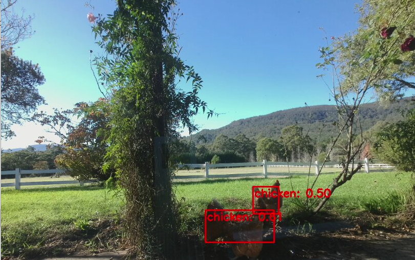
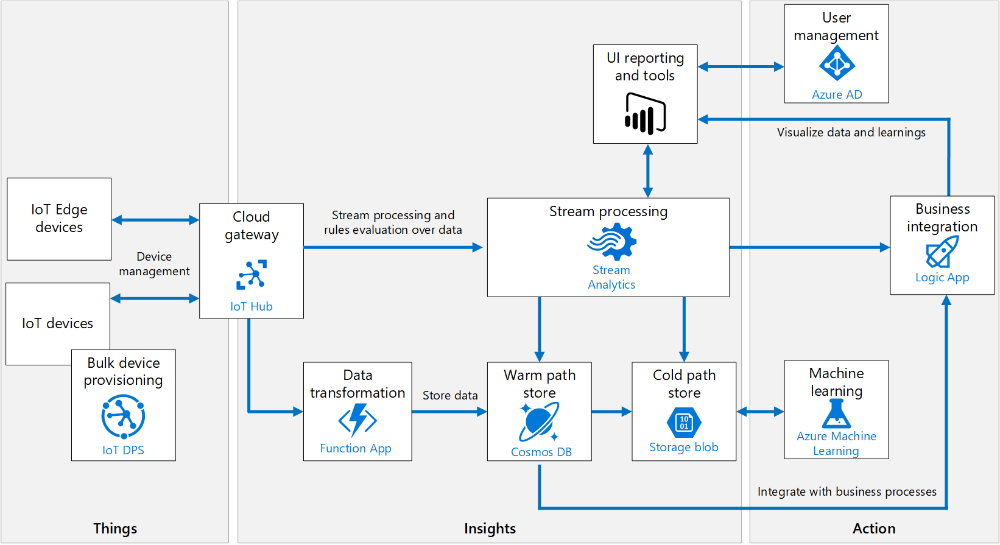
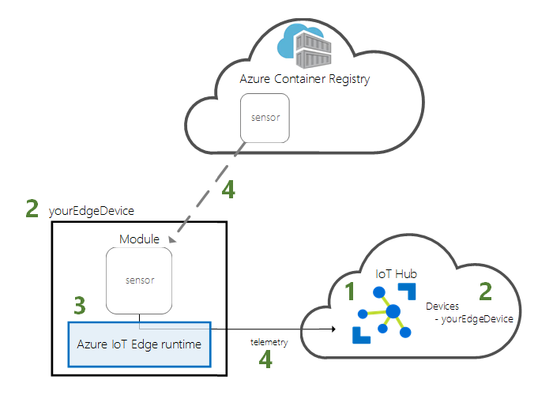
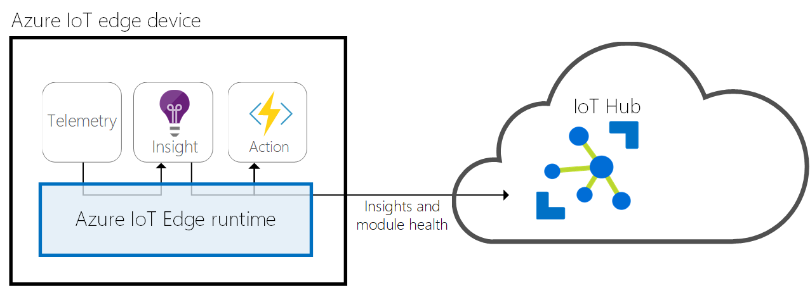

# AI-Conservation

<H1> Exploration of Live Video Analytics in Australian Wildlife Conservation.</H1>

<H2> Chicken-AI -protoype</H2>
 
The repository contains a trained YOLO model which identifies chickens in a live video stream. 

"26-May-Chickens.avi" is the result recording an RTSP feed of the first training iteration, which was based on 100 images captured using the [Azure Percept development kit](https://azure.microsoft.com/en-au/pricing/details/azure-percept/#)

Instructions for [deploying the Development Kit](https://docs.microsoft.com/en-us/azure/azure-percept/quickstart-percept-dk-set-up#). 

The [Azure Percept Portal](https://ms.portal.azure.com/#blade/AzureEdgeDevices/Main/overview) is integrated with [CustomVision.AI](https://www.customvision.ai/) , this enables you to automate image capture, label images, train models and then deploy the trained model to the appliance.

You do not need Azure Percept Development Kit to explore and build for Vision on Edge Scenarios [check out this blog post](https://techcommunity.microsoft.com/t5/internet-of-things/bringing-your-vision-ai-project-at-the-edge-to-production-is-now/ba-p/2259359)

<H2> Geese-AI -protoype</H2>
 
The repository contains a trained YOLO model which identifies Scott Morrison in a live video stream.

<h2> IoT Edge Concepts </h2>

[Review the IoT Reference Architecture](https://docs.microsoft.com/en-us/azure/architecture/reference-architectures/iot)

[IoT Hubs](https://docs.microsoft.com/en-us/azure/iot-hub/about-iot-hub) manage devices such as IoT Edge Devices (compute) / IoT Devices (sensors) check out this [quickstart guide](https://docs.microsoft.com/en-us/azure/iot-edge/quickstart-linux). 

[IoT Edge Modules](https://docs.microsoft.com/en-us/azure/iot-edge/iot-edge-modules) are containers, they can be stored in Azure Container registry or other public / private registries and deployed from IoT Hub to IoT Edge Runtime.

 
[IoT Edge Runtime](https://docs.microsoft.com/en-us/azure/iot-edge/iot-edge-runtime) consists of the [edgeHub](https://docs.microsoft.com/en-us/azure/iot-edge/iot-edge-runtime#iot-edge-hub) and [edgeAgent](https://docs.microsoft.com/en-us/azure/iot-edge/iot-edge-runtime#iot-edge-agent).

Following this [tutorial](https://docs.microsoft.com/en-us/azure/iot-edge/module-composition) to learn how to deploy modules and establish routes in IoT Edge.
 
IoT Edge Modules can operate [offline](https://docs.microsoft.com/en-us/azure/iot-edge/iot-edge-modules#offline-capabilities) after syncing at least once with IoT Hub. You cannot however create, delete or update IoT Edge modules that are running on an IoT Edge when it is disconnected. [Inter Module communication](https://docs.microsoft.com/en-us/azure/iot-edge/iot-edge-runtime#module-communication) is configured using routing statements (data input and output)  and can include routing back to IoT Hub for use other Azure Services.
 
Outside of deploying modules to IoT Edge you may also need to configure the Edge compute's Port Bindings using [Container Create](https://docs.microsoft.com/en-us/azure/iot-edge/how-to-use-create-options) options:
1.	[Give modules access to host storage](https://docs.microsoft.com/en-us/azure/iot-edge/how-to-access-host-storage-from-module)
2.	[Map host port to module port](https://docs.microsoft.com/en-us/azure/iot-edge/how-to-use-create-options#map-host-port-to-module-port)
 
Binding Tip
For example, on a Linux system, "Binds":["/etc/iotedge/storage/:/iotedge/storage/"] means the directory /etc/iotedge/storage on your host system is mapped to the directory /iotedge/storage/ in the container. 
 
You can deploy so many Azure Services as container modules to IoT Edge:
1. 	[Azure Functions](https://docs.microsoft.com/en-us/azure/iot-edge/tutorial-deploy-function)
2. 	[Azure Stream Analytics](https://docs.microsoft.com/en-us/azure/iot-edge/tutorial-deploy-stream-analytics)
3.	[SQL Server (Time Series Insights) and SQL DB Edge](https://docs.microsoft.com/en-us/azure/iot-edge/tutorial-store-data-sql-server)

The [MSFT Repo can be found here](https://github.com/microsoft/containerregistry/blob/master/docs/dockerhub-to-mcr-repo-mapping.md)
